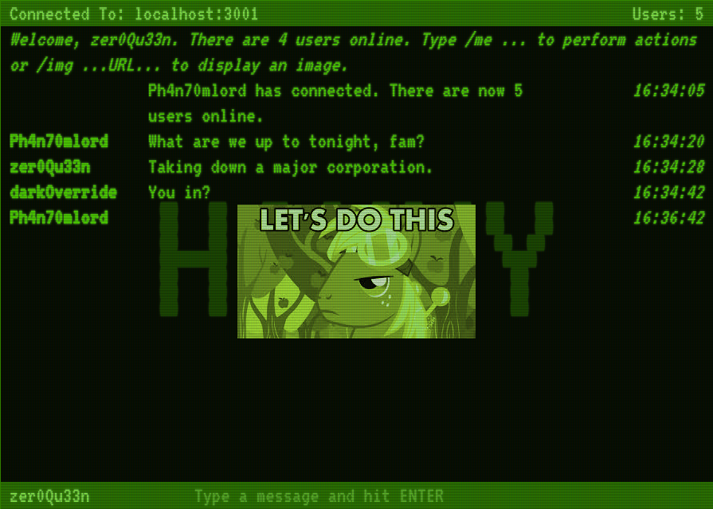

# Haxxy

A simple, real-time chat app built with React and a WebSocket-based backend. Users can perform chat actions using the traditional `/me ...` command, or share images using `/img ...URL...`.

## Usage

- Clone this repository.
- In both the client and server folders, run `npm install`.
- In the server folder, run `npm start`.
- Open a new terminal and, in the client folder, run `npm start` as well.
- Navigate your browser to `localhost:3000`.
- Open more browser tabs or windows as needed to simulate multiple users.

## Future Ideas

- I'd love to have this app running on a public-facing platform like Heroku. I know how to deploy static sites, but (at the time of writing) it's a little beyond me for something like this.

## Dependencies

- React
- Express
- Webpack
- Babel
- ESLint
- A number of plugins for the above libraries. See the client's _package.json_ if you're genuinely curious.

## Attributions

- The flickering CRT effect was adapted from a post by [Alec Lownes](http://aleclownes.com/2017/02/01/crt-display.html)
